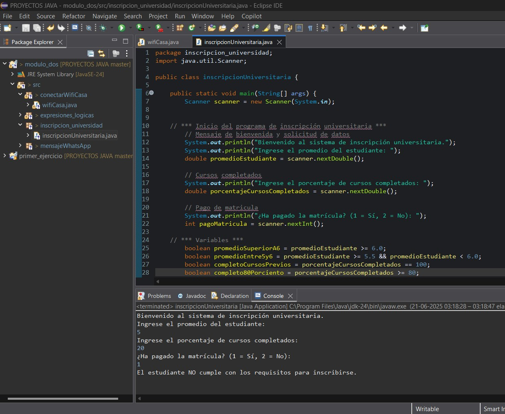
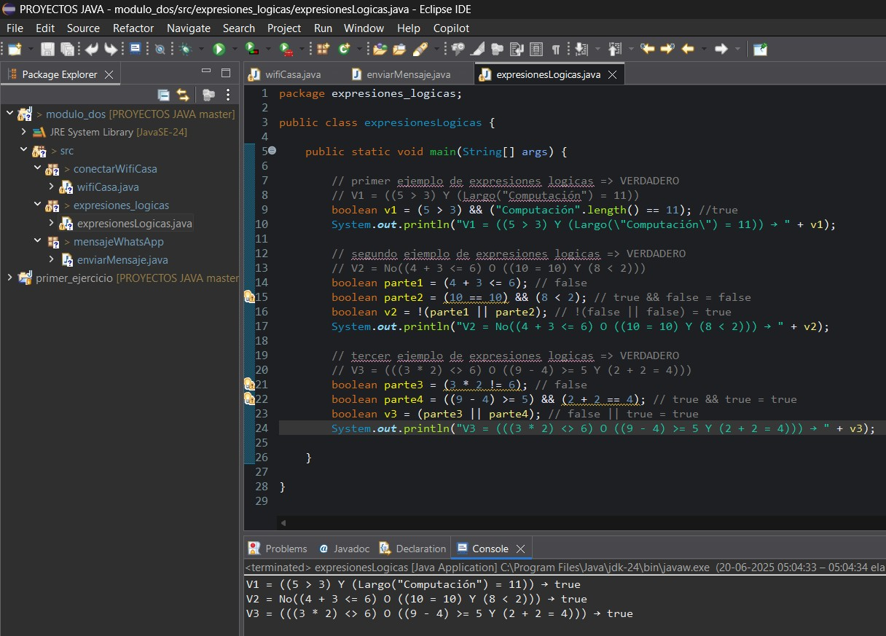

**_<h1 align="center">:vulcan_salute: Ejercicios con Java :computer:</h1>_**

**<h2>Instrucciones mensaje WhatsApp</h2>**
- Proyecto en que se indican los pasos que se deben seguir para enviar un mensaje de WhatsApp:

**<h2>Conectar a Wifi</h2>**
- Para poder conectar a una red de internet se requiere del nombre de usuario y contraseña correctos.
- Se plantea con 3 intentos los dos posibles resultados:

 

**<h2>Matricula Universitaria</h2>**
- De acuerdo a instrucciones asociadas al promedio de notas, asistencia y pago de matricula, se evalua ingreso de estudiantes.
- Se aplico a dos casos para ver los dos tipos de resultado:

      
    

**<h2>Expresiones lógicas</h2>**
- 

**<h2>Promedio notas</h2>**
-
