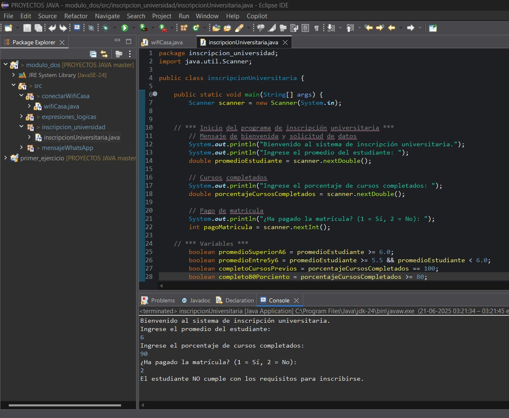
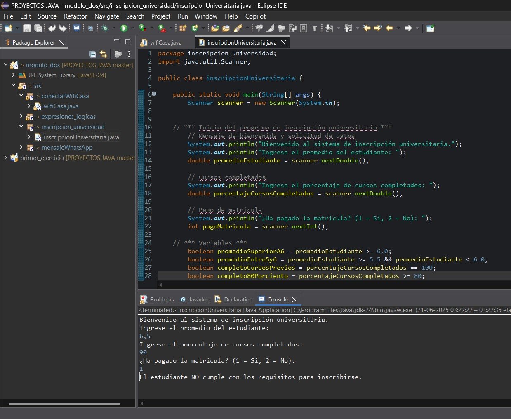

**_<h1 align="center">:vulcan_salute: Ejercicios con Java :computer:</h1>_**

**<h2>Instrucciones mensaje WhatsApp</h2>**
- Proyecto en que se indican los pasos que se deben seguir para enviar un mensaje de WhatsApp:
- [Link código proyecto](https://github.com/KathyAlde21/proyectos_java_app_mov/tree/master/modulo_dos/src/mensajeWhatsApp)

**<h2>Conectar a Wifi</h2>**
- Para poder conectar a una red de internet se requiere del nombre de usuario y contraseña correctos.
- Se plantea con 3 intentos los dos posibles resultados:
- [Link código proyecto](https://github.com/KathyAlde21/proyectos_java_app_mov/tree/master/modulo_dos/src/conectarWifiCasa)

 

**<h2>Matricula Universitaria</h2>**
- De acuerdo a instrucciones asociadas al promedio de notas, asistencia y pago de matricula, se evalua ingreso de estudiantes.
- Se aplico a dos casos para ver los dos tipos de resultado:
- [Link código proyecto](https://github.com/KathyAlde21/proyectos_java_app_mov/tree/master/modulo_dos/src/inscripcion_universidad)

  

**<h2>Expresiones lógicas</h2>**
- Revisión de expresiones lógicas como booleanos
- [Link código proyecto](https://github.com/KathyAlde21/proyectos_java_app_mov/tree/master/modulo_dos/src/expresiones_logicas)

**<h2>Promedio notas</h2>**
- Ingreso la cantidad de estudiantes y luego completo los campos.
- Entrega lista con elementos ingresados y promedio de notas.
- [Link código proyecto](https://github.com/KathyAlde21/proyectos_java_app_mov/tree/master/modulo_dos/src/promedio_notas)

**<h2>Puntaje obtenido en competencia deportiva</h2>**
- Se deben ingresar los puntajes de 8 competidores.
- Como resultado se obtiene el orden inverso al ingreso y el orden de la nota más alta a la más baja.
- [Link código proyecto](https://github.com/KathyAlde21/proyectos_java_app_mov/tree/master/modulo_dos/src/puntajes_invertidos_estudiantes)

**<h2>Registro de donaciones</h2>**
- Se selecciona una causa para realizar la donación, que seguira en bucle hasta ingresar la palabra FINALIZAR.
- Pide ingresar el nombre de la causa que aunque está escrito con mayúscula, el código incluye toUpperCase() por lo que no afecta el como se escribe.
- Una vez que se ingresa **finalizar** se suma lo ingresado a cada causa y el total. 
- [Link código proyecto](https://github.com/KathyAlde21/proyectos_java_app_mov/tree/master/modulo_dos/src/registro_donaciones)

